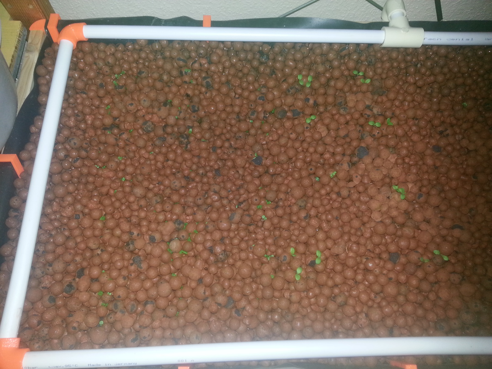
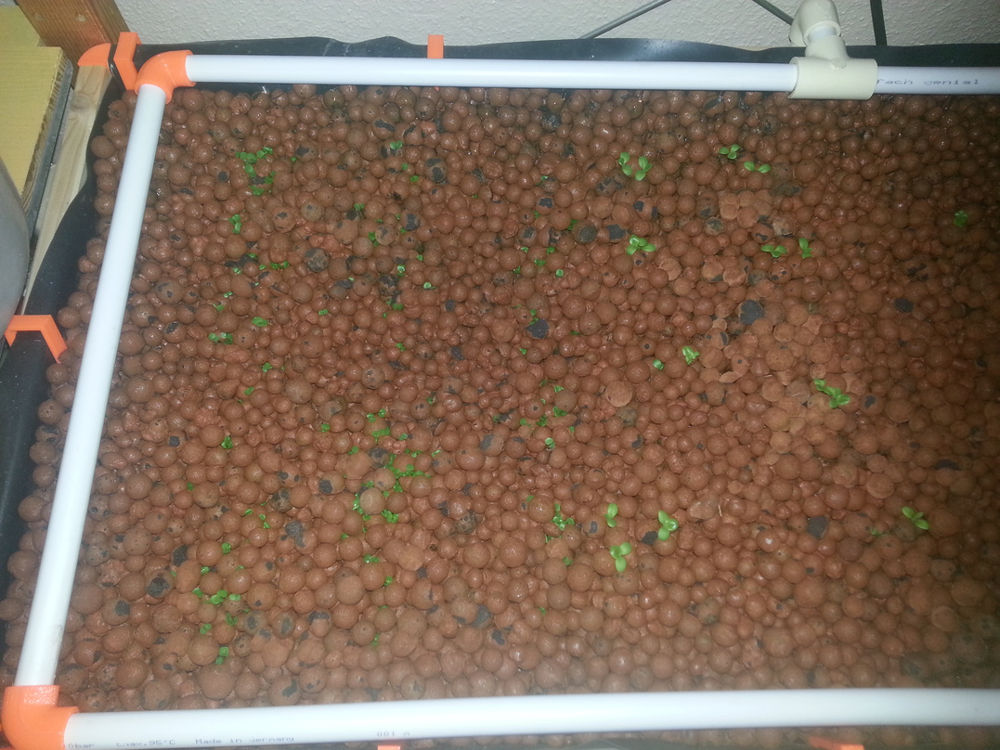
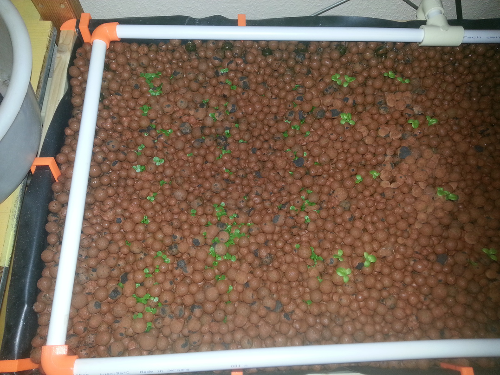
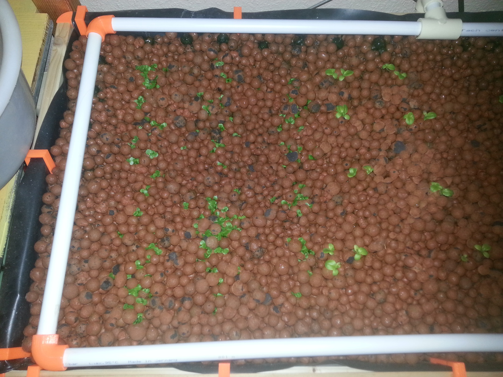
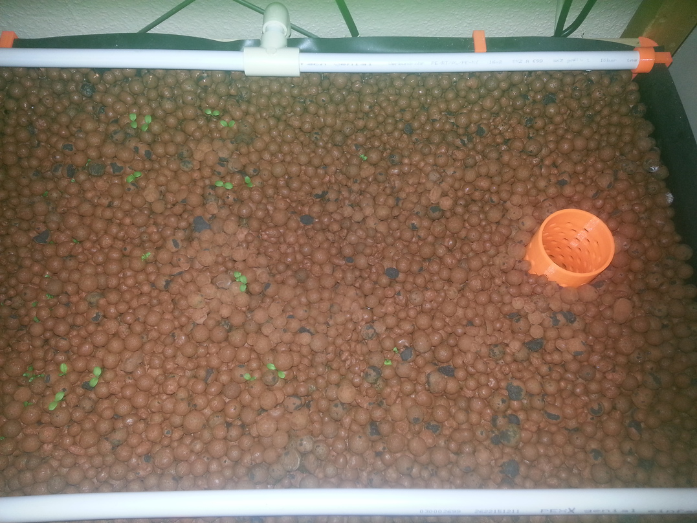
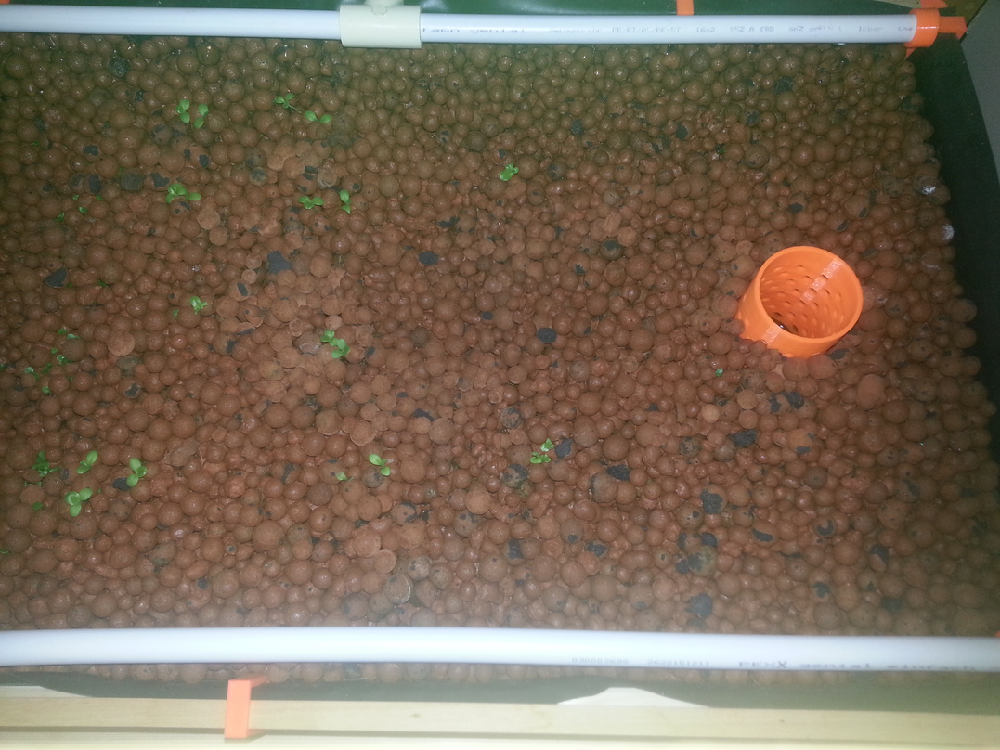
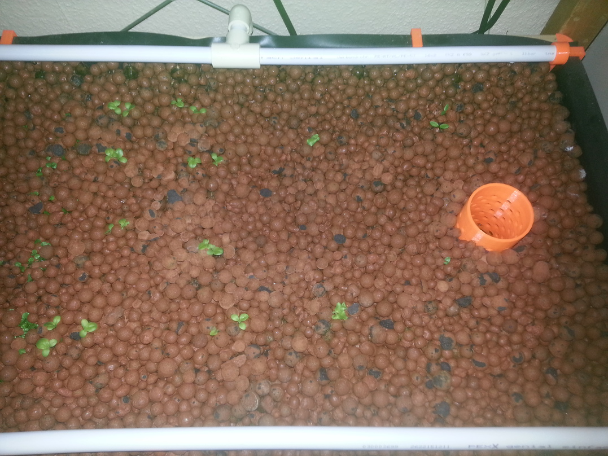
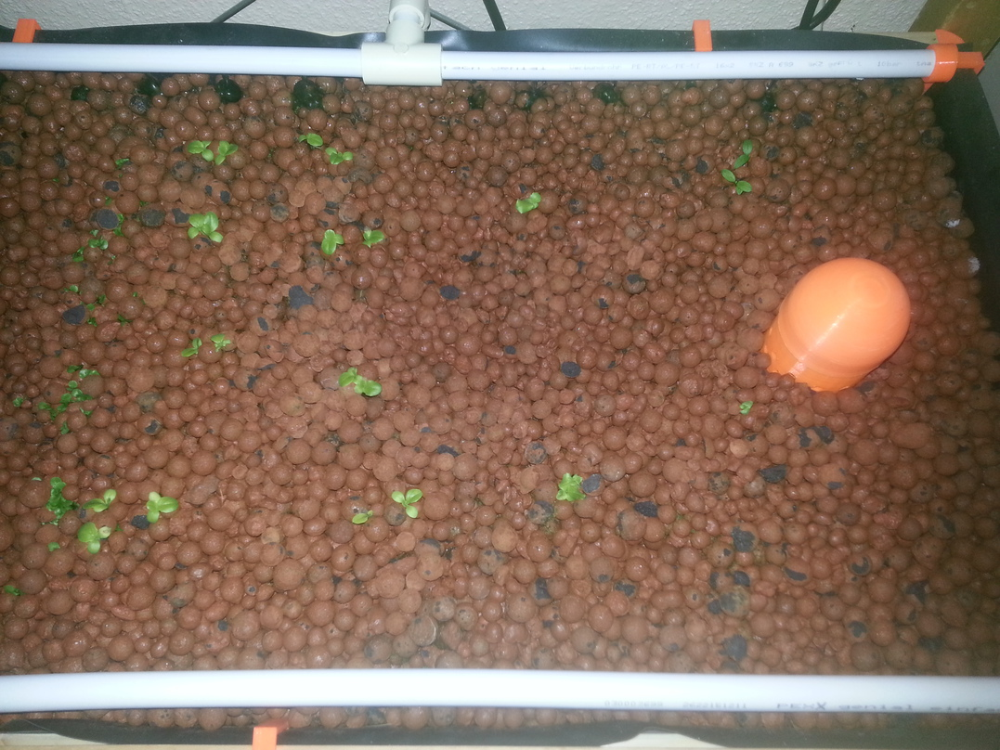
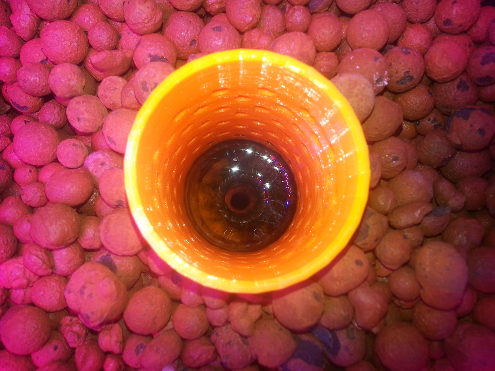

------------------------------------

Title:  Fast then steady ?

Author: Mark Moissette 

Date:   2016-02-14 

------------------------------------

##Fast then steady ?

###Overall: 

>Note:
The LED lamps are on 12 hours per day , on analog timer

* Growth has been very fast in the first few days , but seems to have been slowing down

  Then again, my perceptions of what is "slow" or "fast" are hardly accurate and/or scientific at this stage.
  
  The initial sprouting speed for most of the Lettuce was much faster than what was advertised on the seed bags (usually around  **6 vs 15 days** ), but the further we go , the less I can compare with known metrics (if you do know of a reliable source of Lettuce growth rates, please let me know)

* Almost all the plants have secondary or ternary leaves
* Plant health seems good: nice green color, no discoloring along the edges, no signs of burns 

####More details:

- The amount of Lamb's lettuce (L) that has been poping all over the left side of the grow bed, almost creating a "carpet"
of small leaves. It might need to be "trimmed" down to a more reasonable amount of plants.

- All of Romaine (R) seedlings already have their third set of leaves are showing good color (no discoloration at the edges),
but I find their growth seems to have slowed down a lot in the past 3 days or so

- Curly lettuce have been growing slowly but steadilly , and interestingly , their secondary leaves already show the typicall "chiseled" 
aspect

- Basilicum (B) : this one is underwhelming, as only a single seed sprouted, and the seedling seems very small and fragile: then again
I never had much luck with the specific seeds I used and Basilicum in general, so I might be doing something the wrong way

- Parsley (P) : this one is a nice surprise, it sprouted suddenly on the 8th and has been growing "fast" since

####Photos:
> Note: I usually take photos every night, from the "top" of the setup , one for the left side, one for the right side, plus some extras

Left side

Right side:

### Algae growth 

There has been some **very** intensive growth of "algae" (to my knowledge) at the pipe outlets and inside
the media guard : it looks like very thick black/green gunk, and seems generates oxygen bubbles: aka 'it's alliiive'!

The media guard / main outlet can easilly be covered up, but I will have to come up with a solution for the outlets.

### New inhabitants!

Yesterday, On the 2016-02-13 , three additional goldfish (2x small, one medium) where introduced into the aquarium, 
as I feared only 3 goldfish (the previous population) would be a too low fish to plant ratio . 
Might be stretching the population limits as far as the aquarium size (60L) goes but is still within acceptable range

![Goldfish, getting used to their strange new surroundings]
(./2016-02-14/20160213_151950.jpg)

### Software: 

 * slow and steady so far ! 

 * resumed my work on the sensor network : have started experimenting with MQTT with great sucess so far
 (seems much more reliable than my half hearted REST attempt), so this meant exploring new things on the arduino
 side (ESP8266 running Arduino firmware) and on the Node.js side 

    * At this stage I still consider using a full featured MQTT broker like [Mosquito](http://mosquitto.org/) to be overkill, though that could change
    * Using the simple yet functional MQTT server/broker provided with [Mqtt.js](https://github.com/mqttjs/MQTT.js) 

 * also continued on the server side code, finally taking time to clean some of the things up , etc, nothing too exciting too far though 

>Where ?
 * Server/client side code you can check out here : https://github.com/GreenBotics/automaton
 * Arduino firmware etc is here https://github.com/GreenBotics/green-skies

### Next steps:

  * still need a permanent, functional system to record environemental data , so work on the Node.js / Arduino software
  * docker setup for the Raspberry Pi "master node" is still a must
  * I need to reorganize all the different repositories , as it is quite a mess right now, still not sure what best organization will be
  * need a way to hide pipe outlets from the light (water + nutrients + lights === algae, lots of algae)

